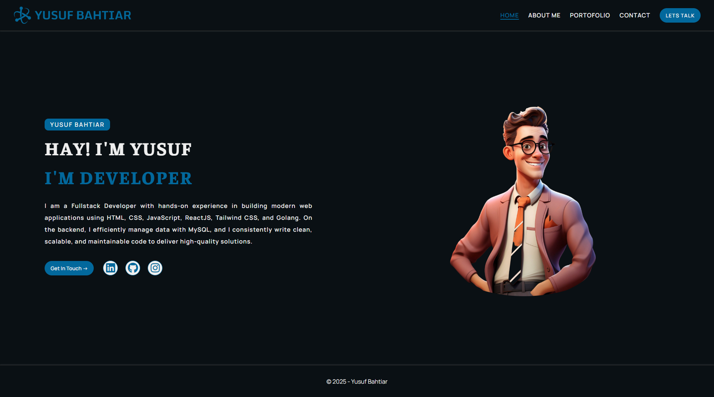

# Personal Landing Page

## Deskripsi - Navigation Bar with Flex
Project ini merupakan latihan HTML CSS dalam membangun website. Saat ini kita membangun website pribadi dengan penerapan materi HTML dan CSS. Tujuannya adalah untuk membiasakan diri dengan alur kerja pengembangan perangkat lunak.


## Preview

- Versi Desktop  



- Versi Mobile


## How to run this Project

1. Clone this project
```
git clone https://github.com/yusufbahtiarr/yusuf.github.io.git
```
2. Enter the project directory
```
cd yusuf.github.io
```
3. Install the Depedencies
```
npm install
```
4. Run the project
```
npm run dev
```
5. Project will running on http://localhost:8080

## Dependencies

This project requires Node.js to run. Please ensure Node.js is installed on your machine before proceeding.
Require Package:
- live-server : a simple development HTTP server with live reload capability. It is used to simulate a local server environtment for testing and development purposes.
